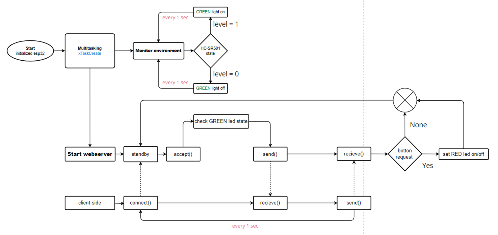
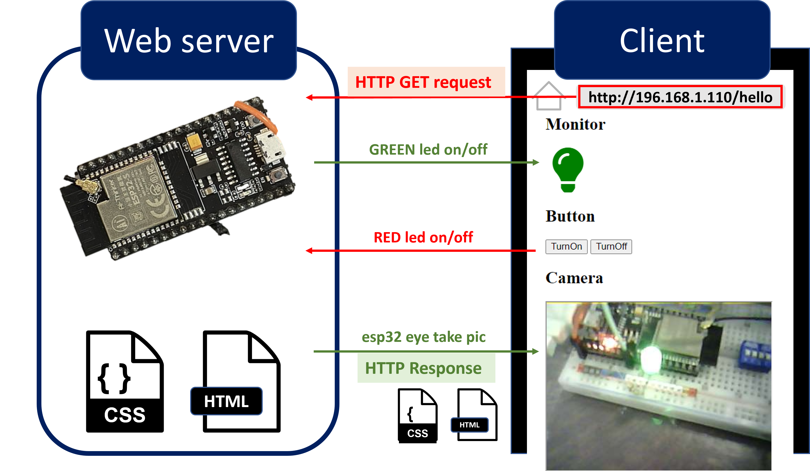

# System host ver.1
## Introduction
將硬體端esp32當static web server，由web(client 端)對伺服器發起 HTTP request進行單向訪問，伺服器經由網路接受HTTP請求後，透過HTTP協定傳送回復給客戶端。
## Function Description

## Development Improvement
1. Polling takes up cpu execution time (busy loop)
   在client端訪問server端時，此處使用每100ms訪問一次(可見webServerHTML.html文本)，以此專案而言不符合效益，多數時間是在做busy waiting，雖已增加muititask來增加使用率，但若加大控制規模仍過於費時費空間。
   solution in ver.2 : server 端可以主動發起推送
3. HTTP response
   此處做法是每次訪問時將HTML作為return value直接回傳給client而未打包成檔案，雖作法簡單直觀，但有難以維護(用char儲存內並回傳指標的形式，會須考慮到C語言語法限制，因此以此次實作而言，對HTML文本的維護較為繁瑣)、傳送形式單一(考量到C語言的變數型態)的問題。
   solution in ver.2 : SPIFFS 打包檔案回傳  
   
